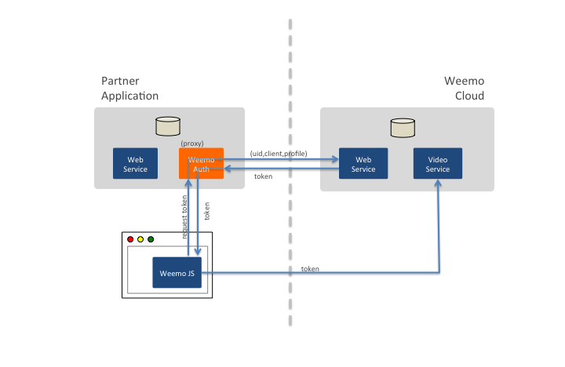
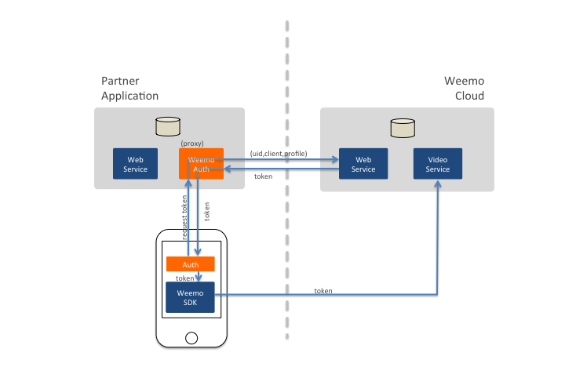

# Weemo Server-SDK Collection #


Our server SDKs are easy to integrate into your web application server or mobile back-end.  The Weemo Server SDK component is used to generate tokens.  A token is how the Javascript library and the iOS and Android SDKs gain access to Weemo Video services.

Weemo provides Server SDKs in the following languages.  Each development package includes a Weemo library and a demonstration server showing the library in use.

| Collection         | Description  |
|:------------------:|--------------|
|        | [Java](Java) - Official Java Library and demonstration server |
|   | [Ruby](Ruby) - a Ruby Library with Rails implementation notes and demonstration server |
|          | [Php](PHP)  - Official PHP Library and demonstration server |
|       | [Node.js](Node.js) - Official Node.js Library |
|    | [.NET](NET) - Community contributed (and unsupported) .NET/CSharp libraries and test programs |


## Overview of Weemo Authentication

As a service provider you are granted the ability to issue tokens for your users.  A token is short-lived (it must be used within 15 minutes), and it can only be used once.  Thus, each time your Javascript front-end or Mobile application initiates a new Weemo session you should request a new token.

A token binds your user to a particular group and grants certain permissions.  Each request for a token from your server will send three pieces of information to Weemo in exchange for a token. 


| Parameters         | Description |
|--------------------|-----------------------|
| uid                | A unique identifier for the user on your system.  Most often this is an email address, but you can use a different identifier if you choose. |
| identifier_client  |  An identifier for the domain group that the user belongs to.  This is simply your domain name if all users belong to the same group.  If you are a multi-tenanted service provider, this identifies the tenancy of the user.  |
| id_profile         | This defines the capabilities granted to the user by service class.  Typical profiles are "standard" or "premium".  |

Note: there are restrictions on the UID.  It should be at least 6 characters long and it must not include special characters like: ```<space>```, ```<hash>```, ```<percent>```, ```<ampersand>``` , ```<question>```, ```<quote>``` or ```<plus>```.


### Authentication for Javascript Clients

To obtain a token for a web-based application using the Weemo Javascript package you will implement a small proxy method on your server.  (In the figure below, the proxy method is shown in orange.)  The method will examine the identity of the user requesting the token and will forward a call to Weemo with the uid, identifier_client and id_profile parameters.  The token is then returned to the browser and used to initialize the Weemo Javascript object.  The request from the browser to the proxy method can be made with a jQuery ```$.ajax``` call or something similar.




The Javascript in your web-app will use the token to initialize a new Javascript Weemo Object.

### Authentication for Mobile Clients

To obtain a token for a mobile application you will need to implement a small proxy method on your back-end and will need to implement an HTTP request to the back-end on your mobile client.  (In the figure below, these two pieces of information are shown in orange.)  Your back-end should verify the identity of the user making the request before requesting a token from Weemo.



Your mobile application will hand the token to the WeemoSDK upon initialization.  The WeemoSDK uses the token to authenticate itself to the Weemo Cloud.


## Client Certificates and Application Secrets

Weemo uses strong encryption and client certificates to verify the identity of your server, and uses a client id and secret to verify your application.  When you receive your authentication provider welcome message you will receive the pieces of information described below.  The README files for each of the client libraries describes how to use the certificates and secrets, so you do not need to read this unless you are interested.

The first three pieces of information are used to configure the SSL connection from your server to Weemo.

- weemo-ca.pem: This is a certificate authority that verifies the identity of the Weemo server.
- client.p12: This is a container that contains a key and certificate that verifies the identity of your server to Weemo.
- passphrase: This is password that unlocks the .p12 file.

The next two pieces of information are used to identify your application server.

- client_id: a 30 character string uniquely identifying your application.
- client_secret: a 30 character string that accompanies the id above.

Each of these pieces of information should be regarded as precious and secret.  As an application developer you should take precautions to make sure that these credentials remain locked down.


## Further Documentation

If you are developing with Rails or PHP on Mavericks (OSX 10.9.2) or later, you should read this note: [Mavericks](doc/Mavericks.md).

